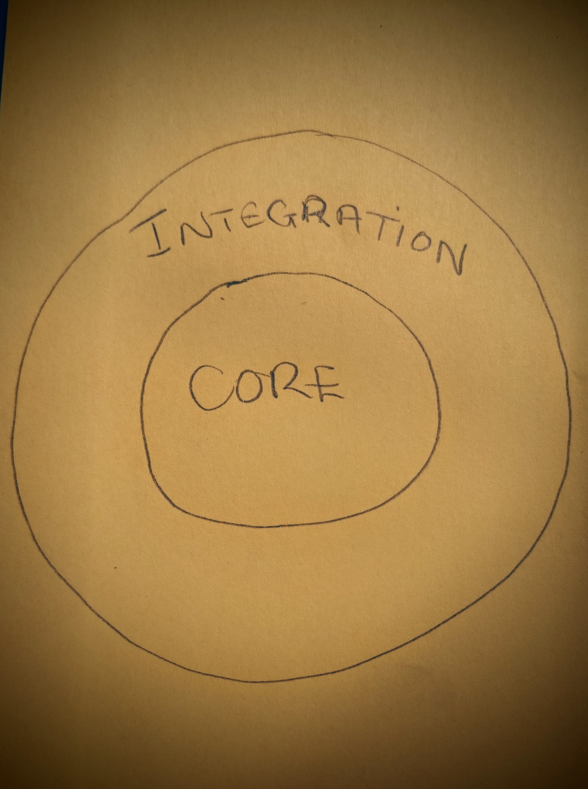
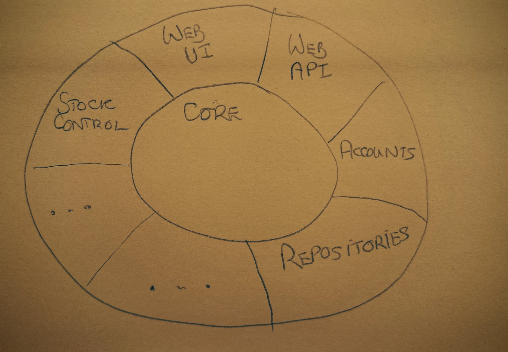

# life-preserver
The Life Preserver and its contribution to adaptable software

When working with clients and as part of our training courses we often go through the exercise of producing one of more Life Preserver diagrams. We use this as an alternative approach to using layered architecture diagrams, as there are a number of problems with the layered architecture view (see below). The approach with the life preserver actually helps us organise our components and reflect the true structure of our software. It should also help identify the drivers for change in the system.

###The Questions 

The key questions we are looking to answer with the **Life Preserver**  are:

* Where does my component go
* How do I make sure my component is as simple as possible
* How do I visualise and manage coupling to ensure I can easily change my software to accommodate future needs 

###The Layered Architecture

The layered architecture is commonly used for visualising and conceptualising a piece of software, it presents an idealised view that each layer is neatly built on top of another layer. The problem with this is that it does not reflect the reality of how the underlying software is implemented, the layers quite quickly get violated. The service layer will normally contain the Domain Objects that reflect the business logic for our domain. A common problem is the Domain Objects is they end up bridging the horizontal layers effectively breaking out of the layered architecture.

Another factor with the layered architecture view is it looks the same regardless of the domain that you representing. So if the layered architecture view does not reflect reality of where my components go or how the software is designed then its a bad tool for understanding, rationalising and conceptualising your software. This is where the Life Preserver comes in.  

###What the Life Preserver represents in our software

The life preserver diagram is going to represent a bounded context, which is a phrase that has emerged from Domain Driven Design. When we are developing software we develop a language that relates to particular part of our domain. This could be equally applied to a legacy system where components already exist or to a new system that we are creating. To develop a domain model is complex and to do globally across a whole organisation is prohibitively expensive, so we need to decompose our model and represent parts of the system as a Bounded Context. We can then develop our domain model within that context.  We should always ensure that the software we are developing should ultimately deliver value to the business.   

With the life preserver diagram we draw two concentric circles, the centre shows the core of our system, the outer layer represents the integration layer.

* **Core** the part of the system that represents the area where we have complete control over the change and development of the components. Each part of the core would usually represent a component that contributes value to the business i.e it makes us money
* **Integration** in this layer we isolate all the parts of our core that have touch points into the outside world. We do not have full influence over when these components change. We usually divide up the integration layer where each section identifies the external interface it is connecting too. This could be an external system or another bounded context within our domain. We would create a component inside the integration layer for each touch point and it is this touch point that influences the changes in this component.

###Life Preserver Phase 0 

Identify the components of your bounded context and plot them on a life preserver diagram. Show any known integration components in the integration layer. We usually make the diagram from a large piece of paper showing the **core** and **integration** layers and use 'stickie' notes to represents the components that are going to reside in each layer. Usually at this stage the diagram is going to look a little bit messy.

We are now going to steadily refine the diagram. First we want to try and ensure we have simple components and we apply a process to do this, the stages are:

* **Organise** the main thing here is making sure our components are in the right layer, if we think there are components in our core layer that have external influences, then we should divide that component up and introduce a new component in the integration layer and simplify the core component
* **Reduce** for each core component you have identified try to ensure it has been reduced to a single concern, that is as far as the component is concerned it does just one thing 
* **Encapsulate** ensure the component has a well defined interface and only exposes essential operations. 

When performing these steps we must ensure it is performed in the order shown, as if we encapsulate first we just end up in hiding complexity, do help use remember this we use the acronym **O.R.E**

###Life Preserver Phase 1

The next activity on our diagram is to apply **O.R.E.** to the diagram and also as part of this we need to consider component naming. 

####Naming

We should be avoiding the use of nouns, instead we should be naming our components after the activities they do. We should definitely be conscious of terms like "...Manager" in the names as this implies hidden complexity in the component and also suggests the component has more than one purpose. Also if the component contains an 'and' in the title it is also suggesting multiple purpose components. Another warning bell is the adoption of code names for components as this also suggests complexity and multi-purpose components.  
If we name the components after the activities that they do, we end up defining a language around what our system does that can be shared across the stakeholders on of the business.  We refer to this as the Ubiquitous Language. 

###Life Preserver Phase 2

The next phase of our work on the  life preserver is to consider the components in the integration layer. We consider the integration layer to be made up of **Adaptors** and **Gateways**.

An **Adaptor** represents a one-way path through the integration layer, this could be an inbound path or an outbound path, and what we are talking about here is data flow across the integration layer. 

A **Gateway** represent a two-way path through the integration layer, again we consider the directionality of the data path, but as a Gateway is a two-way data flow, it is the instigator of the connection that gives us the directionality. So if connection is instigated from the core it is an outbound Gateway, whereas if the connection is instigated from the external source it is an inbound Gateway.

###Rename integration components

The next step then,  is to rename our integration to components to reflect if they are **Adaptors** or **Gateways**, we should also reflect the directionality in the name.

###Life Preserver Phase 3

Having identified the **Adaptors** and **Gateways** in our integration layer we should look at the components in our core. 

#### Group together what changes together

We should be able to identify which components connect to the adaptors and gateways, and if these are multiple components we should group them together.  The fact that they are associated with a particular Gateway or Adaptor suggests that changes that are applied via that interface could cause associated changes in the core components. In the ideal world we would accommodate those changes in the Gateway or the Adaptor, thus leaving our core unchanged (which is our goal), but at times this can't be avoided. Thus by grouping the components together in this way, we should group together components that are likely to change together. This organisation can also start to inform how we organise our components in terms of packaging. 

####Communication lines

We should also add communication lines to our diagram so we can see what components talk to each other. In terms of communication  we can have: 

* paths within the integration layer, where one component talks to another within the integration layer.
* paths within the core layer where part of the core talks to another part of the core
* path's across the boundary between the core and the integration layer - this is where and integration component connects to a core component. In all cases a core component must be isolated from anything outside the integration layer 

As far as the Life Preserver is concerned now we should have a number of things represented:

* **Bounded Context** the life preserver diagram should represent a single bounded context. It may connect to other Bounded Contexts via a Gateway or Adaptor in the integration layer.
* **Core** the centre of the diagram shows the core components for my Domain within the Bounded Context. Within the core we should have grouped together all those components that change together. The change influencers are the connections that are made through the integration layer.
* **Integration Layer** shows all the adaptors and gateways that isolate the core components from the external influences on context
* **Communication Lines** these should show the connections between the adaptors and gateways and the core components 

From the diagram so far we can identify **Events** and **Commands** coming into the system. The difference being an **Event** is something that has happened in the past that is relevant to the system. A **Command** is a request that requests something should happen to the system, unlike an event the command is not a statement of fact, its is a request and that request can be refused. 

In terms implementation our core should consist of components that that should  fit into categories of **Aggregates** and **Views**, where an Aggregate is a domain entity that updates state within the system and a View is a domain entity that provides a read only view of the system. The main consideration with the Aggregate is that all the updates associated with a command must happen within a transactional boundary, and only on successful completion of that transaction should a response be sent back to the original requester.

The next stage with the Life Preserver is to create a full table of events/commands relating to our system and for each entry we want to record

* Name for an event - for an event it would be a verb in the past-participle such as AccountUpdated, if it's a command the name would be an imperative verb, reflecting it is a request, such as CreateAccount 
* Description - further description of the events/commands, they should be simple data structures that contain data for reading (they are immutable) and they should be self contained.
* Idempotent - an indication if the same event is repeated the system will remain in the same state
* Safe - if the event is safe it does not change state within the system, events/commands that change state will be received by an aggregate
* Sender - the name of the sender
* Receiver - the name of the receiver

###Where next

Having worked through the process  of populating the Life  Preserver and the Event Table we should be a good position to start our implementation. The life preserver will help us identify the components we need to implement and also how they should be organised.